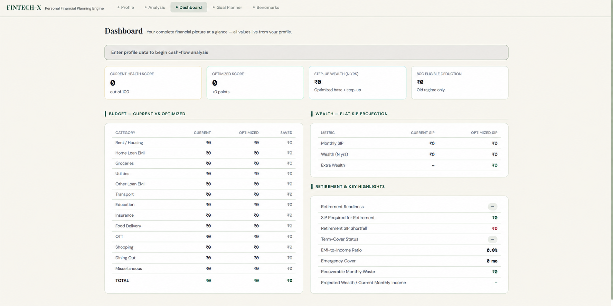
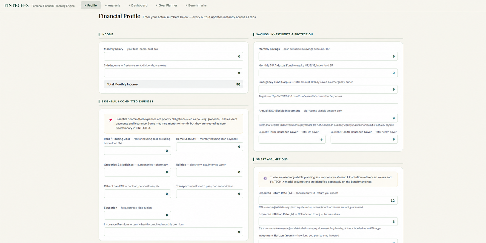
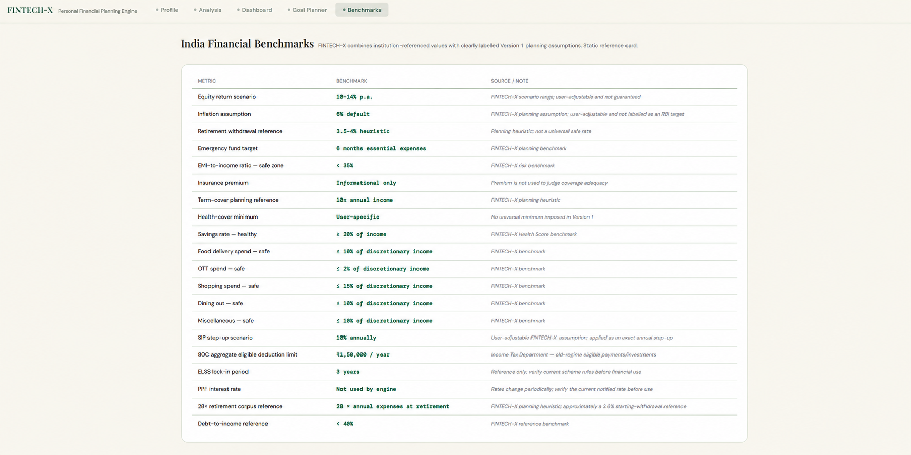

# FINTECH-X

<p align="center">
  <b>From Financial Data to Financial Decisions.</b>
</p>

<p align="center">
  A personal financial decision-support engine that analyzes your complete financial position, finds weaknesses, models an improved plan, and shows how today's decisions may affect your future.
</p>

<p align="center">
  <a href="https://suharshbhatia-19.github.io/FINTECH-X/"><b>🚀 Try FINTECH-X Live</b></a>
</p>

<p align="center">
  
</p>

---

## Why FINTECH-X?

Most financial tools solve **one question at a time**.

FINTECH-X connects your financial life through **one profile and one engine**.

| Typical tools | FINTECH-X |
|---|---|
| Separate SIP, budget and retirement calculators | One connected financial model |
| Show individual numbers | Diagnoses the overall financial position |
| Tell you where you stand | Compares **Current vs Optimized** |
| Generic advice such as “save more” | Quantifies what could change |
| Assumptions often hidden | Benchmarks and assumptions are clearly labelled |

**One profile powers:**

`Cash Flow → Health Score → Spending Analysis → Optimization → SIP → Wealth → Goals → Retirement`

FINTECH-X follows a simple philosophy:

> **INPUT → ANALYSIS → DIAGNOSIS → ACTION**

---

## What It Does

- **Financial Health Score** — savings, debt and emergency preparedness
- **Cash-Flow Analysis** — income, expenses, savings, SIPs and surplus/deficit
- **Lifestyle Leakage Detection** — identifies potentially recoverable spending
- **Current vs Optimized Plan** — shows how financial changes affect the bigger picture
- **SIP & Step-Up SIP Projection** — models long-term wealth scenarios
- **Goal Planner** — inflation-adjusted goals and required investment
- **Retirement Analysis** — corpus, required SIP and funding shortfall
- **Emergency & Insurance Analysis**
- **80C Tracking**
- **Transparent Financial Benchmarks**

---

## See FINTECH-X

### Financial Profile

<p align="center">
  
</p>

### Financial Benchmarks

<p align="center">
  
</p>

---

## How It Works

```text
User
  ↓
Public Frontend
  ↓
Secure API
  ↓
Private Python Financial Engine
  ↓
Analysis & Calculations
  ↓
FINTECH-X Dashboard
